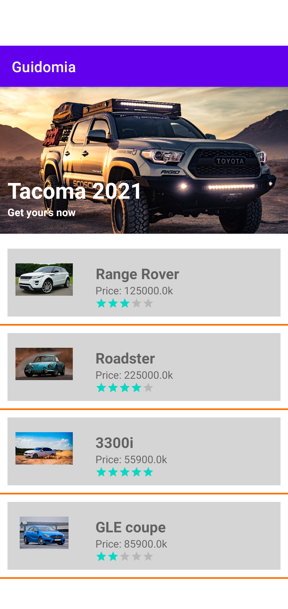

## About

This is a take home assignment project from Bell Android Developer role  

## Setup

Import the project to Android Studio and wait until it resolved all the packages and dependecies. 

## Project Use Case

1. Home Screen: Showing list of posts by cars
   1. Showing: Car Model, Car price, car star rating, car image 

### App Demo 

art/home_screenshot.png

## Tech Stack & Open Source Libraries

- Minimum SDK level 21
- [Kotlin](https://kotlinlang.org/) based, [Coroutines](https://github.com/Kotlin/kotlinx.coroutines) for asynchronous.
- [Koin](https://github.com/InsertKoinIO/koin) for dependency injection. Koin - a pragmatic lightweight dependency injection framework for Kotlin
- Jetpack
  - [ViewModel](https://developer.android.com/topic/libraries/architecture/viewmodel) - UI related data holder, lifecycle aware.
  - [LiveData](https://developer.android.com/topic/libraries/architecture/livedata) - To view data and observe changes
  - [View Binding](https://developer.android.com/topic/libraries/view-binding) - View binding elegently with compile-time satefy 
  - [ConstraintLayout](https://developer.android.com/reference/androidx/constraintlayout/widget/ConstraintLayout) - implementing transformation motion animations.
- Architecture
  - MVVM Architecture (View - ViewModel - Model)
  - Repository pattern
- [Gson](https://github.com/google/gson) - A Java serialization/deserialization library to convert Java Objects into JSON and back

## API

API provided in json file inside teh app

## Unfinished taks

* Level 1: Collapsable views showing pros and cons for each car model
* Level 2: Filter feature based on car model
* Bonus challenge 